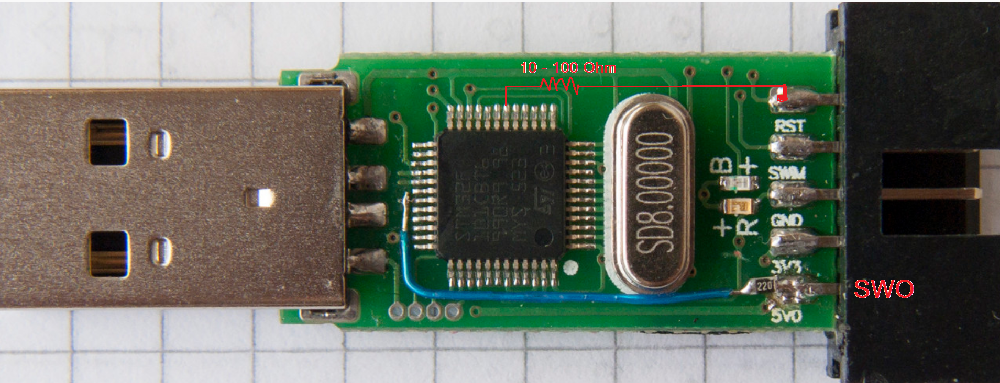

# STM32 Reset & Connection Reference

## 1. Reset Types
These define the scope of the reset—essentially "how deep" the restart goes within the chip's silicon.

| Reset Type       | Scope (What is Reset)                  | How it’s Triggered          | Primary Use Case                                      |
|------------------|----------------------------------------|-----------------------------|-------------------------------------------------------|
| Core Reset       | Processor (Cortex-M) only.             | VECTRESET command.          | Fast restarts during debugging; keeps peripherals (Timers, DMA) active. |
| Software Reset   | Processor + Peripherals.               | SYSRESETREQ in code.        | Standard "reboot" from within an application.         |
| Hardware Reset   | Full Silicon (CPU, Peripherals, Debug).| Physical NRST pin.          | Recovering from a complete system hang or unresponsive state. **Needed when firmware does not have SWD enabled** |

## 2. Connection Modes
These define the "handshake" strategy the ST-Link uses to talk to the chip.

| Mode         | Behavior                              | Resets Chip? | Primary Use Case                                      |
|--------------|---------------------------------------|--------------|-------------------------------------------------------|
| Normal       | Connects while chip is running.       | No           | Standard daily development and flashing.              |
| HotPlug      | Connects without stopping the CPU.    | No           | Inspecting data/memory on a "live" system without interruption. |
| Under Reset  | Connects while holding NRST low.      | Yes          | Recovery: Bypasses "bad code" or disabled debug pins. |

## 3. Troubleshooting Steps
If you encounter "Target Not Found" or connection failures, try these steps in order:

1. **The "Under Reset" Recovery**:
   - Change Connection Mode to Under Reset.
   - Ensure the NRST pin is physically connected to the ST-Link.
   - This forces the chip to stop before it can run code that might block the debugger.

2. **Frequency Adjustment**:
   - Lower the SWD Frequency (e.g., to 950kHz or 400kHz). Long wires or noise often cause failures at higher speeds.

3. **Voltage Verification**:
   - Check that "Target Voltage" in your software reads ~3.3V. If it reads 0V, the ST-Link cannot see the chip's power rail.

4. **The Manual Button Trick**:
   - If you don't have an NRST wire connected: Hold the Reset button on your board, click Connect in the software, and release the button immediately.

5. **Option Byte Reset**:
   - If the chip is "locked," check the Option Bytes in STM32CubeProgrammer. Ensure Read Out Protection (RDP) is set to Level 0.

___

   links:  
   https://lujji.github.io/blog/stlink-clone-trace/  

## enable Reset
The stlink v2 clones are built wrong.

   Removed the resistor R18 which connects the NRST connector pin to the wrong pin on the MCU. Then with a simple resistor 10R-100R I connected to NRST connector pin to the PB0 of the MCU (number 18 of the QFP 48).
   # STM32 Reset & Connection Reference

